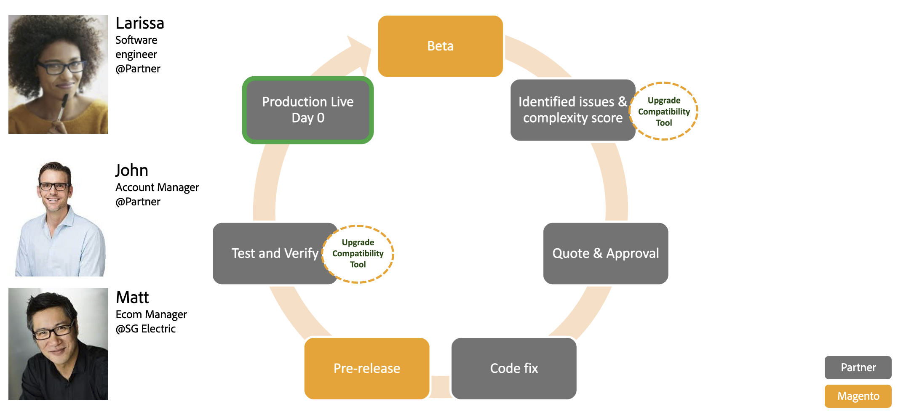

The Upgrade Compatibility Tool is a command-line tool that checks an Adobe Commerce customized instance against a specific version by analyzing all modules installed in it. Returns a list of errors and warnings that must be addressed before upgrading to the latest version of Adobe Commerce.

## Workflow

The following diagram shows the expected workflow when running the Upgrade Compatibility Tool:

{:height="80%" width="80%"}

## Who is the Upgrade Compatibility Tool for?

The following use case describes the typical process for an Adobe Commerce partner to upgrade a client's instance:

1. A partner's Software Engineer downloads the Upgrade Compatibility Tool package from the [Magento repository](https://repo.magento.com/) and executes it during the beta phase of the newest Adobe Commerce release. See the [Download the Upgrade Compatibility Tool]({{site.baseurl}}/upgrade-compatibility-tool/install.html#download-the-upgrade-compatibility-tool) topic for more information.
1. The Software Engineer sees that there are several customized areas broken in the inventory and catalog modules and they also get a complexity score of X. See the [Developer]({{site.baseurl}}/upgrade-compatibility-tool/developer.html) guide for more information on the complexity score.
1. With this information, the Software Engineer is able to understand the complexity of the upgrade and is able to relay this information back to the partner's Account Manager.
1. The Account Manager creates a timeline and cost for the Adobe Commerce upgrade, which allows them to get their manager's approval.
1. With their manager's approval, the Software Engineer works on the required code modifications to fix the broken modules.
1. The Software Engineer runs the Upgrade Compatibility Tool one more time with an Adobe Commerce pre-release to ensure there are no new issues and that their code changes fixed the problems found during the beta phase.
1. Everything checks out and the Software Engineer pushes the code to a staging environment where regression tests confirm all tests are green, which allows them to release the latest Adobe Commerce version to production the same day that the Adobe Commerce pre-release is released.

{:height="80%" width="80%"}

## Contact Upgrade Compatibility Tool

To connect with the Upgrade Compatibility Tool team:

1. Contact us on the Engineering Slack channel [Upgrade Compatibility Tool](https://magentocommeng.slack.com/archives/C019Y143U9F).
1. Send us an email at [uct@adobe.com](mailto:uct@adobe.com).

See the [Resources]({{site.baseurl}}/community/resources/resources.html) page for more information.

## Prerequisites

See [prerequisites]({{site.baseurl}}/upgrade-compatibility-tool/prerequisites.html) for more information.

{:.bs-callout-info}
You can run the Upgrade Compatibility Tool in any operating system. There is no requirement to run the Upgrade Compatibility Tool where your Adobe Commerce instance is located. It is necessary for the Upgrade Compatibility Tool to have access to the source code of the Adobe Commerce instance. For example, you can install the tool on one server and point it at your Adobe Commerce installation on another server.

If you are running the Upgrade Compatibility Tool against an Adobe Commerce instance with large modules and files, the tool might require a high amount of RAM, at least 2GB RAM.

### Recommended actions

Magento best practices recommend to avoid having 2 modules with the same name, if this happens the Upgrade Compatibility Tool shows a segmentation fault error.

To avoid this segmentation fault error it is recommended to run the `bin` command with the added option `-m`:

```bash
bin/uct upgrade:check /INSTALLATION_DIR/<instance-name> --coming-version=2.4.1 -m /vendor/<vendor-name>/<module-name>
```

{:.bs-callout-info}
The `INSTALLATION_DIR` value is the directory where your Adobe Commerce instance is located.

The `-m` option allows the Upgrade Compatibility Tool to analyze each specific module independently to avoid encountering 2 modules with the same name in your Adobe Commerce instance.

This command option also allows the Upgrade Compatibility Tool to analyze a folder containing several modules:

```bash
bin/uct upgrade:check /INSTALLATION_DIR/<instance-name> --coming-version=2.4.1 -m /vendor/<vendor-name>/
```

This recommended command also helps with memory issues that can occurr when executing the Upgrade Compatibility Tool.

## Download the Upgrade Compatibility Tool

To download the Upgrade Compatibility Tool, run the following command:

```bash
composer create-project magento/upgrade-compatibility-tool uct  --repository https://repo.magento.com
```

As the Upgrade Compatibility Tool is an independent tool, if you try to run:

```bash
composer require magento/upgrade-compatibility-tool
```

It might add the Upgrade Compatibility Tool as a dependency for an Adobe Commerce project.

## Install

To install the Upgrade Compatibility Tool, you must install the necessary prerequisites:

*  Magento access keys
*  Composer
*  Node.js (only required to check GraphQL compatibility)

Refer to the [Upgrade Compatibility Tool install]({{site.baseurl}}/upgrade-compatibility-tool/install.html#install) page.

### Magento access keys

You must have [Magento access keys]({{site.baseurl}}/marketplace/sellers/profile-information.html#access-keys) to download and use the Upgrade Compatibility Tool. Add your Magento access keys to your `auth.json` file, which is located at `~/.composer` by default.

{:.bs-callout-warning}
Check your **COMPOSER_HOME** environment variable to see where the `auth.json` file is located.

The **public key** corresponds to the _username_ whereas the **private key** is the _password_:

### Example of Magento access keys

```json
    "http-basic": {
        "repo.magento.com": {
            "username": "YOUR_MAGENTO_PUBLIC_KEY",
            "password": "YOUR_MAGENTO_PRIVATE_KEY"
        }
    },
```

### Composer

Clone the Upgrade Compatibility Tool repository and run `composer install` in your terminal to install dependencies.

{:.bs-callout-warning}
If the **Magento access keys** are not correctly configured, the Upgrade Compatibility Tool will not install and you will get errors when running the `composer install` command.

### Node.js

To install Node.js, see the Node.js [documentation](https://nodejs.dev/learn/how-to-install-nodejs).

{:.bs-callout-info}
Node.js is only a requirement to check GraphQL compatibility.

## Third-party extensions

Adobe Commerce recommends that you contact your extension vendor to determine whether your extension is fully compatible with Adobe Commerce 2.4.

See [Run the tool]({{site.baseurl}}/upgrade-compatibility-tool/run.html) for information about executing the Upgrade Compatibility Tool.
